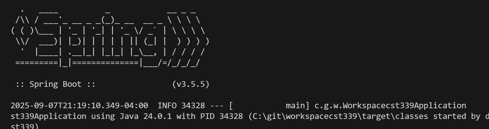
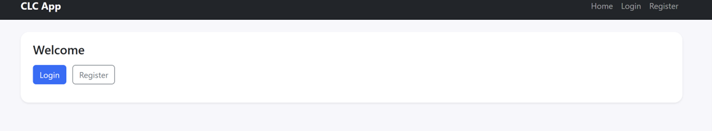
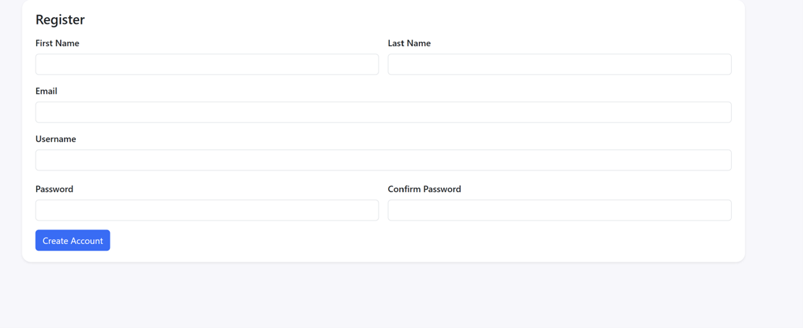
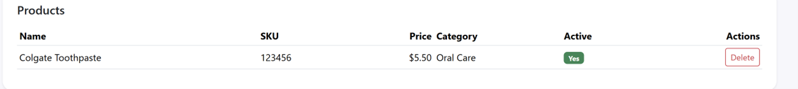
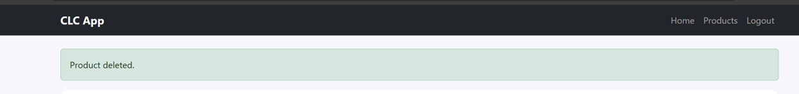

**Name:Devin Puckett**  
**Course:Cst-339**  
**Date:09/08/2025** 

**Professor:Bobby Estey**

---

## 1)  Showing SpringBoot Active on Successful Build 

Terminal showing a successful build with SpringBoot Logo
---

## 2) Login Form

This screenshot shows the Home page of the CLC Spring Boot application. The top navigation bar provides quick links to the Home, Login, and Register pages, ensuring consistent navigation across the site. In the main content area, a welcome message is displayed with two buttons: one for logging in and one for registering a new account. The styling uses Bootstrap, which gives the page a clean and modern appearance. This page serves as the entry point for users, guiding them toward either accessing their account or creating a new one.
---

## 3) Registration Form

This screenshot displays the Registration page of the CLC application. The form collects essential user information such as first name, last name, email, username, password, and confirmation of the password. Bootstrap styling provides a clean layout with labeled input fields and a clearly defined “Create Account” button. This page allows new users to create an account, which is a critical step before accessing restricted features like product management. The design emphasizes simplicity and user-friendliness, making it easy for users to complete the registration process.
---

## 4) Shows Product Sucessfully Added and the ability to Delete 

This screenshot shows the Products page of the CLC application after successfully creating a product. The table lists product details including the name, SKU, price, category, and whether the product is active. A green badge labeled “Yes” clearly indicates the active status, while a red “Delete” button allows the user to remove the product from the list. Bootstrap styling makes the table clean, readable, and professional. This page demonstrates that product creation and management features are working as intended.
---

## 5) Showing Repetitive Thymeleaf

This screenshot highlights the consistent navigation bar that appears across all pages of the CLC application. Using a Thymeleaf fragment, the navbar provides links to Home, Products, and Logout, ensuring a uniform user experience throughout the site. The success alert “Product deleted.” is also displayed, showing feedback when a product is removed. By centralizing the navbar into a shared template, any updates to navigation automatically apply across every page, reinforcing both consistency and maintainability in the application’s design.

## - Conclusion
Overall, this build shows that the main parts of the CLC application are working the way they should. The navigation bar is consistent across all pages, which makes the app easy to move around in. I was able to register a new account, log in, and then create a product successfully. The products page not only lists the items with all their details but also gives the option to delete them, and I got clear alerts when actions happened, like registering or deleting. With the Bootstrap styling in place, the pages look clean and organized, and the Thymeleaf templates make everything flow together. This shows that the application is coming together as a complete, usable project.
