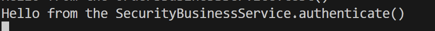

**Name:Devin Puckett**  
**Course:Cst-339**  
**Date:09/08/2025** 

Professor:Bobby Estey

---

## 1)  Orders Business Test 

This screenshot shows the console output when the Service runs. The message "Hello from the OrdersBusinessService.test()" confirms that the service is wired correctly and is being called by the controller. It proves that dependency injection and the Spring Bean setup are working as expected.
---

## 2)  Security Business Test

This screenshot shows the console output from the Service. The message "Hello from the SecurityBusinessService.authenticate()" confirms that the authentication service is running when the login form is submitted. It proves that the service is properly connected to the controller and works as part of the login process.
---

## 3) My Orders

This screenshot shows the Orders page displaying a list of products. The table includes order details like ID, order number, product name, price, and quantity. It confirms that the application successfully retrieved the order data from the business service and displayed it on the webpage.
---

## 4) Orders in JSON 

This screenshot shows the output of the orders in JSON format. Each order includes an ID, order number, product name, price, and quantity. It confirms that the application can return data as JSON, which is important for APIs and allows other systems or frontends to use the order data.
---

## 5) Orders in XML

This screenshot shows the orders being returned in XML format. Each order is wrapped in tags like id, orderNo, productName, price, and quantity. It confirms that the application can serve data not only as JSON but also as XML. This makes the project more flexible for different types of systems that may consume the data.
---

## 6) Formatted JSON

This screenshot shows the orders displayed in a pretty JSON format. Each order has fields for the ID, order number, product name, price, and quantity. It makes the data easier to read compared to the single-line JSON output and proves that the application can return well-formatted JSON for testing or API use.
---

## 7) Formatted XML 

This screenshot shows the orders displayed in a formatted XML view. Each piece of data, such as the order number, product name, price, and quantity, is wrapped inside tags. It is easier to read than the browser’s plain XML output and confirms that the application can generate clean, structured XML for outside systems to use.
---

## - Conclusion
Overall, this project showed how to connect controllers, services, and views together in a Spring Boot application. I was able to log in, display orders, and return the same data in different formats like JSON and XML. The screenshots prove that the business services are running, the data is flowing correctly, and the pages are being rendered with Thymeleaf templates. This assignment helped me see how everything ties together and gave me practice with both front-end pages and back-end services.
---
